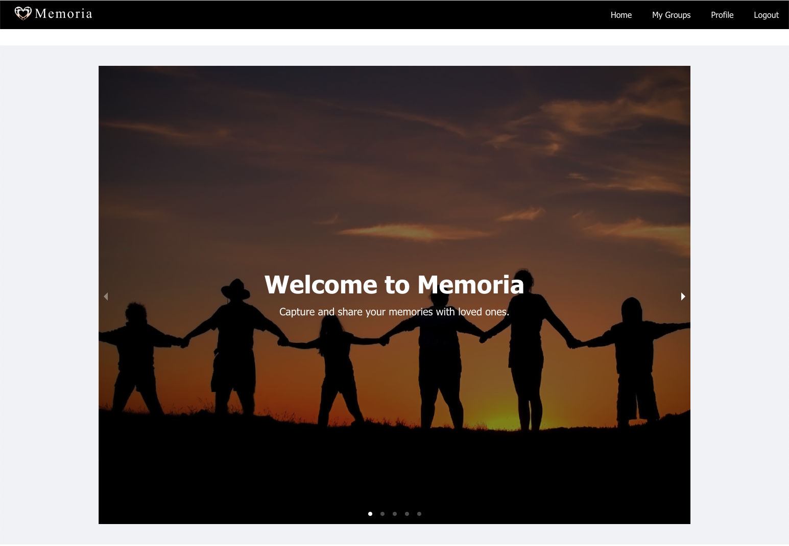
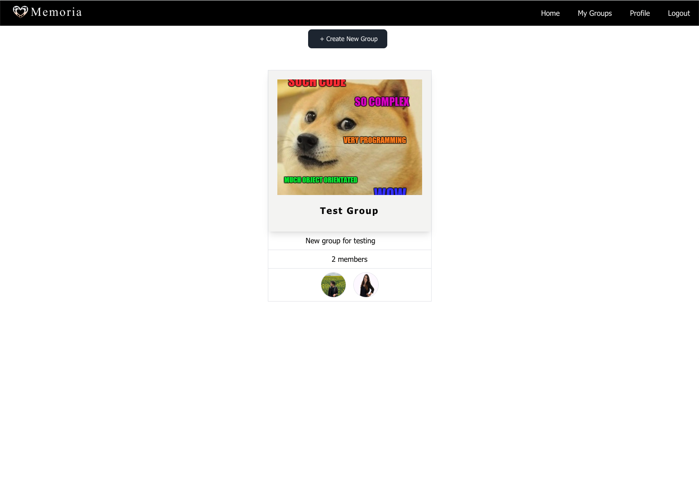
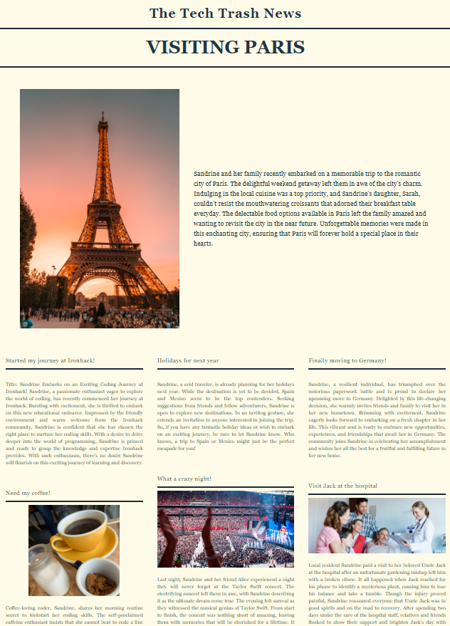
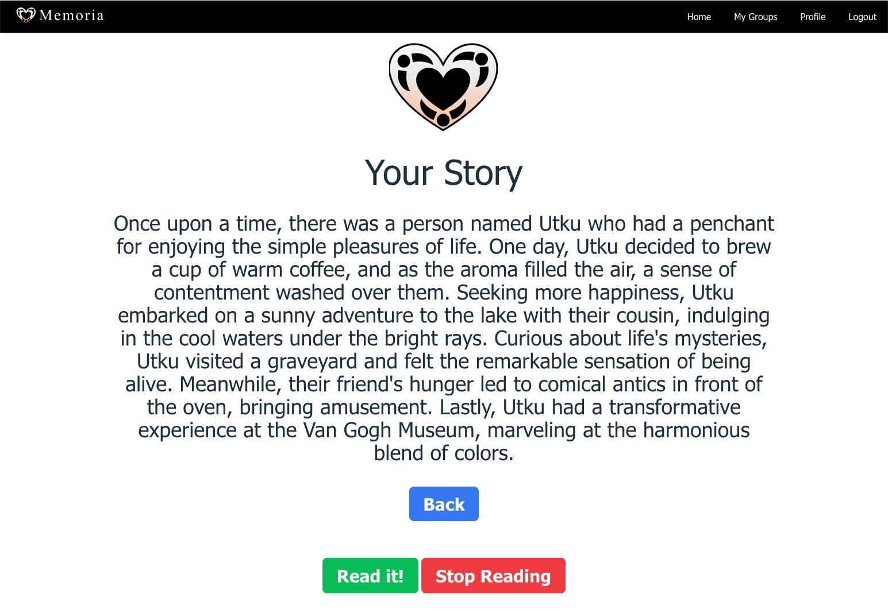

# Memoria App Client

Welcome to Memoria App! This is an web app to connect with your friends and families with fun.

## Instructions to Run Memoria App Client in Your Computer

    - Fork or clone this repository
    - Fork or clone Memoria Server repository
    - Open it with your favorite code editor (i.e. Visual Code)
    - Open the Terminal
    - Run npm install
    - Run npm run dev to start your local server
    - Open the local host in your favorite browser

## API

    - Create a '.env' file in the project folder, and copy paste and replace respectively all the API values

    - VITE_API_URL=3000

## Demo

https://memoriapp.netlify.app/

## Introduction

Memoria Client is a web app developed using React, Tailwind, OpenAI API, Github API, Speech API. It is designed to connect with your groups.

## Features

1. Private Groups

    Create private groups with your closest friends or family members. Share your daily life moments securely within these groups, fostering a sense of intimacy and privacy.

2. Post and Share

    Easily post text, images, and videos to your private groups. Share your experiences, thoughts, and adventures with those who matter most.

3. Story Generation

    Memoria leverages cutting-edge AI technology, including OpenAI's API, to automatically generate stories from the content posted within your groups. These stories can take various forms, from casual chat-like conversations to formal newspaper-style articles.

4. Personalized Narratives

    Tailor the way Memoria generates stories to your liking. Whether you prefer a friendly chatbot tone or a more formal tone reminiscent of a newspaper, Memoria lets you choose the narrative style.

5. Text-to-Speech

    Memoria integrates with Speech API, allowing you to convert your generated stories into spoken words. Listen to your memories being narrated by your computer, adding an extra layer of immersion to your shared experiences.

6. Cloudinary Integration

    Seamlessly upload and store multimedia content using Cloudinary. Your images and videos are securely stored and easily accessible within Memoria.

7. Github Integration

    Keep track of your development progress by integrating with Github API. Stay organized and monitor changes to your codebase effortlessly.

8. Modern UI with React and Tailwind

    Memoria boasts a sleek and responsive user interface built with React and styled with Tailwind CSS. Enjoy a user-friendly experience on both desktop and mobile devices.

## Instructions to Use Memoria APP

### Home

<table>
  <tr>
    <td></td>
    <td></td>
  </tr>
</table>
 

### Groups

<table>
  <tr>
    <td></td>
    <td></td>
  </tr>
</table>
 

### AI

<table>
  <tr>
    <td></td>
    <td></td>
  </tr>
</table>
